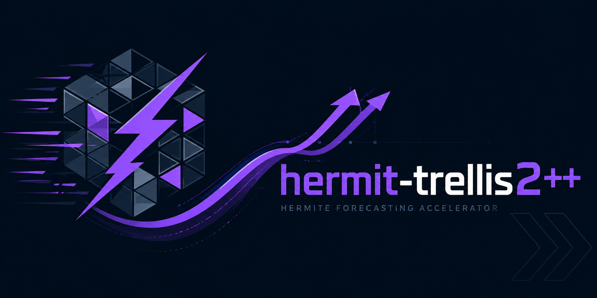

<div align="center">



# 🧭 hermit-trellis2++

**Training-free acceleration for [TRELLIS.2-4B](https://github.com/microsoft/TRELLIS) image-to-3D — the exponential (DMD) forecast variant of [`hermit-trellis2`](https://github.com/Archerkattri/hermit-trellis2), one line of code.**

[](./LICENSE)
[](https://github.com/microsoft/TRELLIS.2)
[](https://arxiv.org/abs/2512.14692)
[](https://arxiv.org/abs/2508.16984)
[](https://arxiv.org/abs/2312.12487)

`TRELLIS.2-4B` · `1024_cascade` (mesh + texture) · training-free · single RTX 5090 · MIT

</div>

## When to use this repo

These repos are **complementary accelerators, not competing solutions** — each speeds up a *different*
base generator, and the `+` / `++` suffix is a **method choice**, not a rival product. Pick by
**(1) which base model you run**, then **(2) which forecast basis you want**:

| base generator | `+` = HiCache (Hermite) | `++` = HiCache++ (DMD) |
|---|---|---|
| Hunyuan3D-2.1 | `hunyuan2.1-plus` | `hunyuan2.1-plus-plus` |
| Hunyuan3D-2 mini | `hunyuan2-plus` | `hunyuan2-plus-plus` |
| SAM 3D Objects | `sam3d-plus` | `sam3d-plus-plus` |
| Fast-SAM3D | `fastsam3d-plus` | `fastsam3d-plus-plus` |
| DiT-XL/2 (ImageNet) | `dit-plus` *(unreleased)* | `dit-plus-plus` *(unreleased)* |
| TRELLIS (v1) | `faster-trellis` | `faster-trellis-plus-plus` |
| TRELLIS.2-4B (v2) | `hermit-trellis2` | `hermit-trellis2-plus-plus` |

- **`+` (HiCache / scaled-Hermite):** the *published* polynomial velocity-forecast basis — conservative, reproduces the HiCache paper. Use it to deploy the established method.
- **`++` (HiCache++ / DMD exponential):** our Dynamic-Mode-Decomposition basis — *the same near-lossless quality at wider skip intervals*, where the polynomial diverges. Use it when you push the cache interval for more speed.
- **standalone / model-agnostic:** [`hicache-plus-plus`](https://github.com/Archerkattri/hicache-plus-plus) — the forecaster itself, to add DMD caching to *your own* diffusion/flow model.
- **`fast-trellis2`** = the TaylorSeer baseline fork (the upstream "Fast" accel) — the v2 reference point, not a HiCache variant.

> **This repo:** `hermit-trellis2-plus-plus` — **TRELLIS.2-4B × HiCache++ (DMD)** — carved-hybrid; near-lossless at ~1.9×, DMD most lossless on mean F1.

`hermit-trellis2++` is `TRELLIS.2-4B` image-to-3D with the same **training-free carved-hybrid**
as [`hermit-trellis2`](https://github.com/Archerkattri/hermit-trellis2) — but with the
sparse-structure velocity forecast on an **exponential Dynamic-Mode-Decomposition (DMD / Prony)
basis** instead of the Hermite polynomial. It forecasts the model's **final CFG-combined velocity**
and **carves** the structured-latent tokens, so the sampler spends far fewer network evaluations per
asset, with the weights, decoders, and the full `1024_cascade` mesh + texture left untouched.

```python
pipe.enable_faster()                                      # carved-hybrid, Hermite SS forecast (the hermit-trellis2 default)
pipe.enable_faster(); pipe.sparse_structure_sampler.hicache_backend = "dmd"  # ← the exponential DMD forecast (HiCache++)
pipe.enable_faster("base")                                # stock TRELLIS.2 sampler (kill-switch)
```

**What's new vs `hermit-trellis2`.** Same carved-hybrid schedule, same token-carved SLaT stages —
the only change is the **forecast basis on the sparse-structure stage**:

- **HiCache++ (exponential DMD/Prony)** on the **sparse-structure** stage — forecasts the velocity
  with **Dynamic Mode Decomposition** instead of the dual-scaled Hermite polynomial. The exact
  solution of the diffusion feature-ODE is a sum of (damped/oscillatory) **exponentials**, not
  polynomials, so DMD is the natural basis: it stays lossless at **larger skip intervals** than the
  Hermite/Taylor polynomial bases, which diverge once the forecast horizon grows. The early steps,
  where topology is decided, are still always computed.
- **Token-carved SLaT** on the **structured-latent** stages — unchanged from `hermit-trellis2`: a
  learned-cadence temporal skip plus spatial **token carving** that recomputes only the
  high-frequency voxels each step.

**Relationship to the family.** [`hermit-trellis2`](https://github.com/Archerkattri/hermit-trellis2)
is the **HiCache (Hermite)** parent — the v2 instance of the Hermite carved-hybrid (whose v1 sibling
[faster-trellis](https://github.com/Archerkattri/faster-trellis) beats Fast-TRELLIS on both speed and
quality). `hermit-trellis2++` keeps that exact carved-hybrid and swaps the Hermite forecast for the
exponential DMD one. The DMD forecaster ships as a standalone library in
[`hicache-plus-plus`](https://github.com/Archerkattri/hicache-plus-plus); this repo is its
TRELLIS.2-v2 integration, selectable with the sampler's `backend="dmd"`.

---

## Quickstart

```bash
git clone https://github.com/Archerkattri/hermit-trellis2-plus-plus
cd hermit-trellis2-plus-plus
# TRELLIS.2 runtime deps (torch, flash-attn, spconv/flex_gemm, o-voxel, cumesh,
# nvdiffrast) per microsoft/TRELLIS.2. Place / symlink weights at ckpts/TRELLIS.2-4B.
```

```python
from trellis2.pipelines import Trellis2ImageTo3DPipeline
from PIL import Image

pipe = Trellis2ImageTo3DPipeline.from_pretrained("ckpts/TRELLIS.2-4B").to("cuda")
pipe.enable_faster()                                       # carved-hybrid
pipe.sparse_structure_sampler.hicache_backend = "dmd"      # ← exponential DMD forecast (HiCache++)

out  = pipe.run(Image.open("input_rgba.png"), pipeline_type="1024_cascade")
mesh = out[0]
```

Leaving `hicache_backend = "hermite"` (the default) gives the original `hermit-trellis2` behaviour;
setting it to `"dmd"` selects the exponential forecast. The DMD snapshot-window length is the
sampler's `history` attribute (default `6`).

`example_faster.py` is the runnable end-to-end script; `example.py` is the stock TRELLIS.2 demo.

<details>
<summary><b>RTX 50-series (sm_120) launch env</b></summary>

`1024_cascade` fits in 32 GB with `expandable_segments`:

```bash
SPARSE_CONV_BACKEND=spconv SPCONV_ALGO=native ATTN_BACKEND=flash_attn \
PYTORCH_CUDA_ALLOC_CONF=expandable_segments:True CUDA_VISIBLE_DEVICES=0 \
  python example_faster.py --image input_rgba.png
```

`SPCONV_ALGO=native` is recommended on newer GPU architectures.
</details>

---

## Results

TRELLIS.2-4B, Toys4K, mesh F-score@0.05 (area-weighted surface samples), 40 objects.

**At the deployed interval (`GF_HICACHE_SS_INTERVAL=2`, ~1.9×), matched n=36** (objects that
succeeded for every variant; the rotationally-degenerate sphere excluded):

| backend | F1 mean | F1 median | Chamfer↓ | speedup |
|---|---:|---:|---:|---:|
| accel off (baseline) | 0.902 | 0.956 | 0.044 | 1.00× |
| Fast-TRELLIS.2 (TaylorSeer) | 0.907 | 0.952 | 0.044 | 1.90× |
| HiCache (Hermite) | 0.896 | 0.965 | 0.048 | 1.90× |
| **HiCache++ (DMD)** | **0.900** | 0.960 | **0.047** | 1.89× |

At the deployed schedule, DMD and Hermite are statistically on par — both near-lossless vs the
accel-off baseline at ~1.9×; DMD is the most lossless on mean F1 and Chamfer.

**The exponential basis earns its keep as the skip interval grows** (matched n=35, Hermite vs DMD):

| `GF_HICACHE_SS_INTERVAL` | Hermite F1mean | DMD F1mean | Hermite F1med | DMD F1med | DMD − Hermite (mean / med) |
|---|---:|---:|---:|---:|---:|
| 2 (~1.9×, deployed) | 0.894 | 0.900 | 0.969 | 0.962 | +0.005 / −0.007 |
| **3** | 0.836 | **0.872** | 0.930 | **0.946** | **+0.036 / +0.015** |
| **4** | 0.839 | **0.868** | 0.898 | **0.935** | **+0.029 / +0.037** |
| 5 | 0.886 | 0.881 | 0.943 | 0.962 | −0.005 / +0.019 |

**Finding.** At the deployed interval the two bases tie (both near-lossless). As the interval grows
to 3–4, **DMD pulls clearly ahead** — +0.03–0.04 mean F-score, +0.015–0.037 median — because the
polynomial (Hermite) forecast degrades faster than the exponential (DMD) one, exactly as the
standalone microbench and the Hunyuan3D-2.1 i3→i6 sweep in
[`hicache-plus-plus`](https://github.com/Archerkattri/hicache-plus-plus) predict. (Interval-5 is
non-monotonic — both partially recover, DMD keeping the median lead — an artifact of the carved
schedule's adaptive clamp; reported as measured.) This confirms **directly on TRELLIS.2-4B** the
HiCache++ thesis: the exponential basis extends the near-lossless skip range past where the
polynomial holds.

---

## How it works

TRELLIS.2 samples a shape in three flow-matching stages — **sparse structure (SS)**, **shape
SLaT** (the 512→1024 cascade), and **texture SLaT** (guidance = 1, no CFG) — each a short Euler
sampler. Both accelerators act on the final velocity `pred_v` those samplers emit.

<details>
<summary><b>① HiCache++ — exponential (DMD/Prony) velocity forecast</b> (replaces network calls on skipped steps)</summary>

At each **compute** step the sampler runs the model and records `pred_v` into a short snapshot
window (the last `history` compute steps). At a **skipped** step it forecasts the velocity by
**Dynamic Mode Decomposition** over those snapshots instead of touching the network:

```
# DMD identifies the linear propagator A from the velocity snapshots,
# its eigen-decomposition A = Φ Λ Φ⁻¹, and advances the modes k steps:
F̂_{t+k} ≈ Φ (Λᵏ · b)
```

**Why exponential over polynomial.** A diffusion feature/velocity trajectory is the solution of a
near-linear feature-ODE, whose **exact** solution class is a sum of (damped / oscillatory)
**exponentials** `Σ bⱼ λⱼᵏ`, not polynomials. DMD — the modern generalisation of Prony's method
(1795) — fits exactly that class: it recovers the modes `(Φ, Λ)` from the snapshots and is **exact on
an exponential series**, which the polynomial Hermite/Taylor bases are not. The polynomial forecasts
grow without bound as the skip horizon `k` increases (Taylor diverges fastest; the dual-scaled
Hermite contracts it but is still polynomial), so the exponential basis is what holds quality at the
**larger compute intervals** this variant targets. For the dense SS latent `pred_v` is forecast
directly; for the SLaT `SparseTensor`s only `.feats` is forecast and coords carry through via
`.replace(feats)`. With too short a window DMD falls back to reusing the last computed velocity.
*(arXiv:2508.16984 for the HiCache/Hermite parent method; the DMD/Prony basis is the `backend="dmd"`
extension.)*
</details>

<details>
<summary><b>② Token-carved SLaT — recompute only the high-frequency voxels</b> (SLaT stages, unchanged from hermit-trellis2)</summary>

The SLaT stages denoise a `SparseTensor` of voxel tokens, and most tokens change slowly between
steps. On each computed step we score every token by **spatial high-frequency energy** (a 3D-FFT
of the sparse-structure occupancy grid) together with its velocity magnitude and frame-to-frame
motion, and recompute only the most active fraction; the smoothest tokens reuse their cached
velocity, under a staleness bound that forces a periodic full refresh so no token drifts. On top of
that a **learned-k delta cache** skips whole steps when the velocity field is locally linear
(`vₜ ≈ xₜ + Δ`). The SS occupancy's per-token frequency score is the same one the SS forecast stage
reads, so the two stages share one signal. *(Fast-TRELLIS token selection; carving level = `GF_CARVE_RATIO`.)*
</details>

<details>
<summary><b>③ Per-stage split</b> (exponential forecast on SS, token carving on SLaT)</summary>

The two accelerations are matched to what each stage costs. The **sparse-structure** stage is a
small dense volume that fixes the asset's topology — the DMD forecast thins it while always
computing the first six steps (`GF_HICACHE_FIRST_ENHANCE`), so the occupancy can't be corrupted.
The **shape and texture SLaT** stages are the sparse, expensive ones — token carving recomputes only
their high-frequency voxels per step and the delta cache skips whole steps. The pipeline computes the
SS occupancy's 3D-FFT frequency score once and hands it to the SLaT sampler (`set_coords_scores`),
so the carving signal is the SS structure itself — wired in `trellis2/pipelines/trellis2_image_to_3d.py`.

**The savings multiply:** the SLaT sampler skips whole steps (delta cache) *and* carves tokens on
the steps it does run, while the DMD forecast independently thins the SS stage.
</details>

---

## Tuning

One shipped configuration; each knob is overridable by env var (takes precedence) or directly on
the swapped sampler instances. The forecast basis itself is the SS sampler's `hicache_backend`
attribute (`"hermite"` default, `"dmd"` for the exponential variant):

| knob | env | default | meaning |
|---|---|:--:|---|
| carving level | `GF_CARVE_RATIO` | `0.10` | fraction of SLaT tokens cached/skipped per step |
| SS interval | `GF_HICACHE_SS_INTERVAL` | `2` | sparse-structure: compute 1 step, forecast `interval − 1` |
| SS first-enhance | `GF_HICACHE_FIRST_ENHANCE` | `6` | always compute the first N SS steps (protects topology) |

```python
import os; os.environ["GF_CARVE_RATIO"] = "0.15"
pipe.enable_faster()
# …or set the instances directly, after enable_faster():
pipe.sparse_structure_sampler.hicache_backend  = "dmd"   # exponential forecast (default "hermite")
pipe.sparse_structure_sampler.hicache_interval = 2
pipe.shape_slat_sampler.carving_ratio          = 0.10
```

---

## What's added on top of TRELLIS.2

All Microsoft TRELLIS.2 model / decoder / o-voxel code is unchanged. Added files only:

- `trellis2/pipelines/samplers/hicache.py` — velocity-forecast cache: Hermite polynomial **and the DMD/Prony exponential** backend (selected by `backend=`), plus the finite-difference / snapshot machinery
- `trellis2/pipelines/samplers/hicache_freq.py` — 3D-FFT high-frequency token scoring (the carving signal)
- `trellis2/pipelines/samplers/flow_euler_carved.py` — the token-carved SLaT sampler (delta-cache step-skip + carving)
- `trellis2/pipelines/samplers/flow_euler.py` — `HiCacheMixin` (`hicache_backend` selector) + the accelerated sampler classes
- `trellis2/pipelines/samplers/__init__.py` — registers the accelerated samplers
- `trellis2/pipelines/trellis2_image_to_3d.py` — `enable_faster()` (single config) + the per-stage wiring
- `example_faster.py`

The accelerators are independent re-implementations of the cited methods on the TRELLIS.2 sampler API.

---

## Credits & license

| | |
|---|---|
| **TRELLIS.2** | [microsoft/TRELLIS](https://github.com/microsoft/TRELLIS) — the pipeline, models, decoders this builds on (MIT) |
| **hermit-trellis2** | [Archerkattri/hermit-trellis2](https://github.com/Archerkattri/hermit-trellis2) — the HiCache (Hermite) parent this carved-hybrid is built on |
| **hicache-plus-plus** | [Archerkattri/hicache-plus-plus](https://github.com/Archerkattri/hicache-plus-plus) — the standalone DMD/Prony exponential-forecast library |
| **HiCache** | arXiv:2508.16984 — Hermite-polynomial velocity forecasting (the parent method the `++` extends) |
| **DMD / Prony** | Schmid, *Dynamic Mode Decomposition of numerical and experimental data* (JFM 2010); de Prony (1795) — the exponential-forecast basis |
| **Fast-TRELLIS** | [wlfeng0509/Fast-SAM3D (Fast-TRELLIS branch)](https://github.com/wlfeng0509/Fast-SAM3D/tree/Fast-TRELLIS) — the token-carving substrate the SLaT stage builds on |

MIT. Accelerations © 2026 Krishi Attri; bundled TRELLIS.2 © Microsoft Corporation. See
[`LICENSE`](LICENSE) and [`NOTICE`](NOTICE).

**Krishi Attri** · krishiattriwork@gmail.com · [github.com/Archerkattri](https://github.com/Archerkattri)

<details>
<summary><b>BibTeX</b></summary>

```bibtex
@software{attri2026hermittrellis2pp,
  author = {Krishi Attri},
  title  = {hermit-trellis2++: Training-free DMD/Prony exponential-forecast acceleration of TRELLIS.2 image-to-3D},
  year   = {2026},
  url    = {https://github.com/Archerkattri/hermit-trellis2-plus-plus}
}
@article{hicache2025,
  title   = {HiCache: Training-free Acceleration of Diffusion Models via
             Hermite Polynomial Feature Forecasting},
  journal = {arXiv preprint arXiv:2508.16984}, year = {2025}
}
@article{schmid2010dmd,
  title   = {Dynamic mode decomposition of numerical and experimental data},
  author  = {Schmid, Peter J.},
  journal = {Journal of Fluid Mechanics}, volume = {656}, year = {2010}
}
@article{trellis2,
  title   = {Native and Compact Structured Latents for 3D Generation (TRELLIS.2)},
  journal = {arXiv preprint arXiv:2512.14692}, note = {microsoft/TRELLIS.2}
}
```
</details>

## Weights & data

Model weights and demo/example assets are **not** committed to this repo — only the acceleration
architecture (code + integration). Download the base-model weights from the upstream project,
[microsoft/TRELLIS](https://github.com/microsoft/TRELLIS), per its instructions, and point the loader at them (see the code / upstream README). This
keeps the repository lightweight and avoids redistributing third-party weights.

---

## Family

Part of the **HiCache++ acceleration family**.

- **Family hub:** [`hicache-plus-plus`](https://github.com/Archerkattri/hicache-plus-plus) — the basis library behind this adapter.
- **Sibling:** [`hermit-trellis2`](https://github.com/Archerkattri/hermit-trellis2) — the same base model with the HiCache (scaled-Hermite) polynomial-forecast variant.
